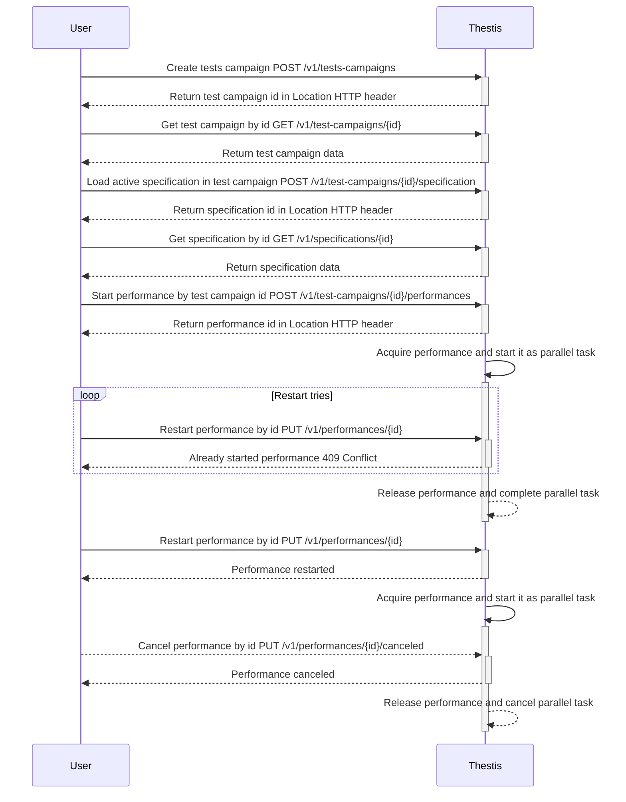
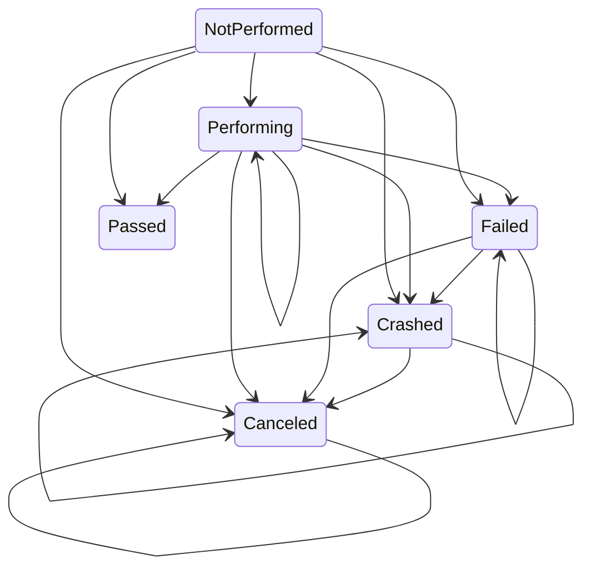

# thestis

Thestis is a service for auto tests with declarative description of tests

## Sequence diagram

## Flow

`Flow` — is unit of `Performance` work. Every working `Performance` parallel task accumulates `Performance` progress information and context in this entity.

`Flow` consists of theses transitions (each with `Thesis` state and occurred errors) and common state. Every transition has state that represents `Thesis` performance progress. But common state is general status of `Performance`. `Flow` common state graph are shown in the diagram:

## Project structure

* `api` — API contract files like _OpenAPI_ files or _proto_ files
    * `openapi` — _OpenAPI_ contract files
* `build` - packaging and CI
    * `package` — cloud, container, OS package configuration and scripts
        * `dev/Dockerfile` — _Dockerfile_ for `Dev` environment
* `cmd` — main applications
    * `thestis/main.go` — application for **Thestis** backend server
    * `thestis-validate/main.go` — main application for **Thestis** validation util
* `configs` — **Thestis** server configuration files
* `deployments` — container orchestration deployment configurations and template
* `examples` — specification, code and other stuff example snippets
* `internal` — private **Thestis** application code
    * `adapter` — application level interface adapters
        * `auth` — implementations of authentication methods
            * `fake` — fake authentication with hardcoded mock secret (only for development)
            * `firebase` — authentication with _Firebase_
        * `logger` — implementations of logging interface
            * `zap` — logger adapter using _Uber's zap_
        * `metrics` — implementations of metrics interface
            * `prometheus` — metrics service collecting metrics with _Prometheus_
        * `parser` — implementations of specification parsers
            * `yaml` — service for parsing specification from _yaml_ files
        * `persistence` — implementation of persistence interfaces
            * `mongodb` — repositories and read models using MongoDB as persistence provider
        * `pubsub` — implementation of pub/sum mechanism
            * `nats` — signal event bus publisher and subscriber using NATS.io
    * `app` — application level interfaces and orchestration code
        * `command` — write operation use cases
        * `mock` — application level interfaces mocks
        * `query` — read operation use cases
    * `config` — **Thestis** application config parser
    * `domain` — domain logic of **Thestis** bounded by context
        * `performance` — pipeline that can run tests flow from specification using multithreading
        * `specification` — tests description in declarative BDD style
        * `testcampaign` — data about testing project, loaded specifications history and active specification
        * `user` — access rights differentiation
    * `format` — **Thestis** application format utils
    * `port` — application control logic
        * `http` — implementation of HTTP level
            * `auth` — authentication
            * `httperr` — mapping errors to HTTP codes
            * `logging` — HTTP level logging
            * `metrics` — metrics collecting
            * `v1` — implementation of `api/openapi/thestis-v1.yml` _OpenAPI_ specification
    * `runner` — **Thestis** backend application code for running from `cmd/thestis/main.go`
    * `server` — **Thestis** server for running from application config
    * `validate` — **Thestis** validate util code for running from `cmd/thestis-validate/main.go`
* `pkg` — public **Thestis** library code
* `swagger` — _Swagger UI_ static source files for UI rendering