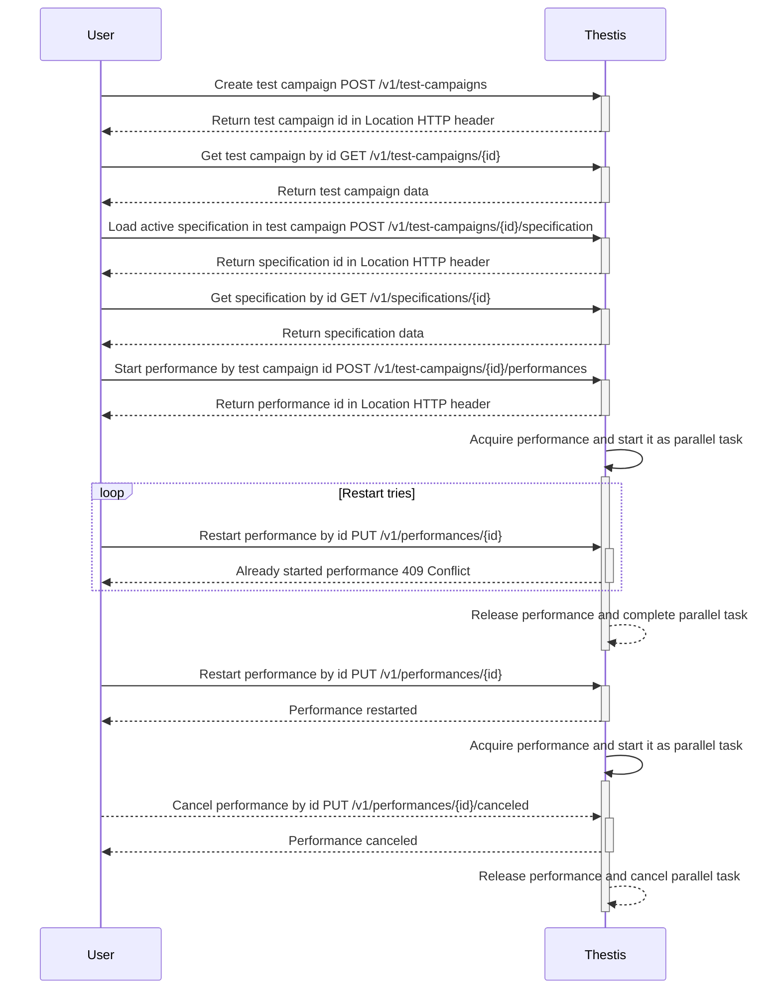
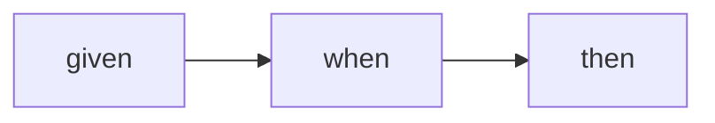
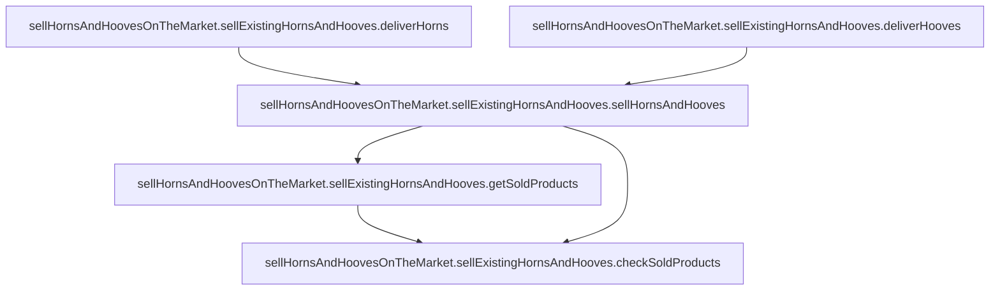
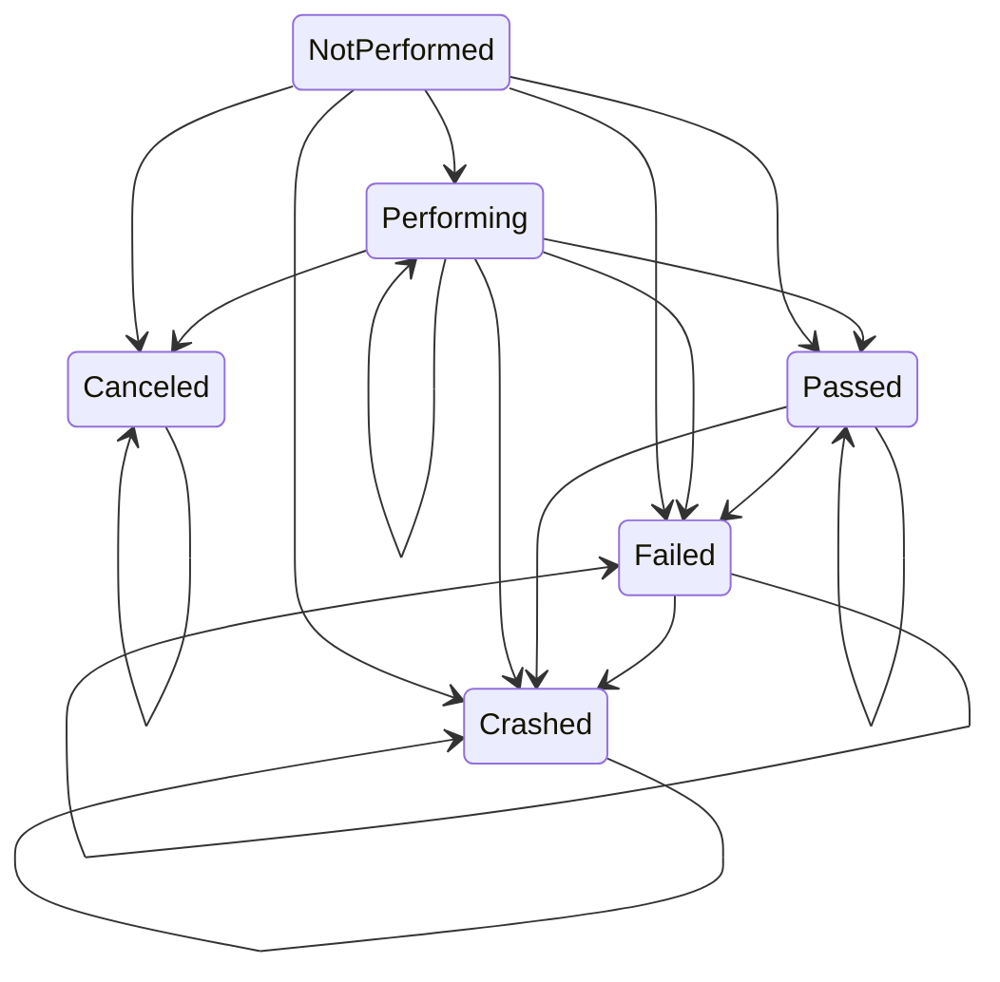

# thestis

<a href="https://github.com/harpyd/thestis/blob/main/api/openapi/thestis-v1.yml"></a>
[](https://codecov.io/gh/harpyd/thestis)

___

__Thestis__ is a service for auto tests with declarative description of tests

## Sequence diagram



## Description

Imagine any CI/CD pipeline. For example you can pay attention to Github Actions. You must write workflow with
declarative pipeline description and push it to remote. If you have specified `on.push` parameter, action with
satisfying workflow will be started if you push. Or you can manually start Action pipeline. Pipeline may include linter,
notifications, unit tests, integration tests, building, deploying, etc...

__Thestis__ is integration tests pipeline for e2e tests. So far pipeline may include 2 thesis types, HTTP and assertion.

Usually, quite a lot of code is written for integration tests in one of the appropriate programming languages, it can be
Java, Python, Go, etc. I've been on several development teams. Each team used something of its own, someone pure Python,
someone wrote their own project-oriented framework for testing on Python, someone wrote tests using Java, each project
had its own integration tests, in the language of the project.

These tests could contain some errors, for example, in a self-written framework that I saw at work, the mapping of JSON
fields into the structure was incorrectly written.

Other tests did not use competitive execution, which is why they were slower than they could.

In others, the code seemed to be correct, but it did not contain the business sense that the manager or analyst wanted,
and, unfortunately, they do not understand the code.

In others, the code is constantly flapping, no one knows why, and does not want to engage, because the code is scary.

In general, there were enough problems. That's how the idea of a pipeline for e2e tests appeared. To get started, you
need to create a `TestCampaign`.

In fact, a `TestCampaign` is the name of your test, information about it, and the history of all
uploaded `Specifications` and completed `Performances`.

`Specification` is a declarative description of the test in BDD style, each test consists of _stories_, each `Story`
of _scenarios_, each `Scenario` of _theses_. The `Thesis` contains a description of the work of part of the test.

```
"Returns go to stock" — example of story

"Refunded items should be returned to stock" — example of scenario
```

The thesis can be either `given`, or `when`, or `then`:

```
"Given that a customer previously bought a blue garment from me and I have two blue garments in stock and three black garments in stock" — example of given thesis

"When they return the blue garment for a replacement in black" — example of when thesis

"Then I should have three blue garments in stock and two black garments in stock" — example of then thesis
```

You can see an example of the `Specification` at the
link [here](https://github.com/harpyd/thestis/tree/main/examples/specification).

When you trigger the pipeline launch in some way, a `Performance` is created. We can say that `Performance` looks like a
program compiled from a `Specification`. The `Performance` is a kind of collected context about the test at the time of
launch from the active `Specification` of `TestCampaign`. Somewhat similar to Github Action.`Performance` collects the
entire dynamic context and the state of the current startup in the `Flow`.

`Flow` is an analog of an attempt at Github Action. Stores information about the launch of `Performance`. `Performance`
will always have at least one `Flow`. `Performance` can be restarted (for example, if a test fails), each time
the `Performance` is restarted, the number of `Flows` will increase.

During the test run, each individual thesis execution status may end up in one of the states:

* __`NotPerformed`__
* __`Performing`__
* __`Passed`__
* __`Failed`__
* __`Crashed`__
* __`Canceled`__

If the test is __`NotPerformed`__, the test has not started yet for some reason. If the test is in __`Performing`__,
then you should expect it to end. If you are in __`Passed`__, you can relax, because the test is passed! If the test is
in __`Failed`__ state, it is worth looking at either the test or the system under the tests. If something went wrong
in __`Crashed`__, perhaps from the network, or maybe from our side. If it is __`Canceled`__, then the test was canceled,
it is possible that you canceled it, and it is possible that we did too because of too long execution.

It is worth noting that the tests achieve the most effective parallelization of the independent parts of the test. How?
See below.

## Entities

### Test campaign

`TestCampaign` is your test, its whole history. You can compare it with a test campaign of some brand like Coca-Cola, a
series of successful and not very successful tests.

Contains general information about the test and user information. Each `Specification` update and `Performance` launch
is associated with this entity. A `TestCampaign` can have only one active `Specification`, the rest are archived. You
can also get a list of all `Performances` launched within the campaign.

### Specification

`Specification` is your code for the test. This entity can be collected from various sources, now, for example, in the
API we get a specification in yaml format, but this is all changeable. `Specification` is format tolerant, any format
will be converted to the internal format.

Stories, scenarios, and theses (_slugged_ objects) have unique identifiers called _slugs_. `Slug` can consist of 1 to 3
parts. The slug of the story consists of one part. Script slug of 2 parts: story part and scenario part. The thesis slug
consists of 3 parts: story part, scenario part ant thesis part.

Formally, each `Specification` consists of _stories_, each `Story` consists of _scenarios_, and each `Scenario` consists
of _theses_.

`Specification` is described in BDD style, each working step of the test is described in `Thesis`. Each thesis can
either make __HTTP__ requests or __assertion__ of the collected data.

BDD tests consist of `given`, `when` and `then` stages. The stages are performed sequentially:



But theses within one stage will be executed in parallel by default. To specify a dependency, specify the name of the
thesis in the `after` field. Then this thesis will be fulfilled after the specified one.

### Performance

`Performance` is the pipeline of your tests built from `Specification`. It starts automatically when it is created. It
can also be restarted. For example, you can see that the test fell through no fault of your own, for example, there was
some kind of network failure, you can restart the previously created `Performance`.

When creating a performance for specification, _performers_ for each type of thesis are registered. `Performer` receives
the thesis, performs an action with it and returns `Result` with `Event` generated inside it for this thesis.

There may be several events:

* __`FiredPerform`__
* __`FiredPass`__
* __`FiredFail`__
* __`FiredCrash`__
* __`FiredCancel`__

`Performance` cannot be run more than once at any given time. That is, `Performance` will never have more than one
active `Flow`.

During `Performance`, each `Scenario` is executed in parallel with `Environment` isolated from other scenarios, and for
each scenario its own `ScenarioSyncGroup` is created to manage the dependencies of each thesis.

View of `Performance`'
s [example](https://github.com/harpyd/thestis/blob/main/examples/specification/horns-and-hooves-test.yml) flow:



At each launch, `Performance` gives information about the execution step by step. Then, from the __steps__ received from
the performance, a flow is collected, showing the current state of the active performance's flow.

### Flow

`Flow` is unit of `Performance` work. Every working performance's parallel task accumulates information about the
progress of the performance and the context in this entity. Each run of `Performance` corresponds to one `Flow`.

`Flow` reduced from _steps_ received during the execution of `Performance`.

`Flow` consists of _statuses_ (each with `Slug`, `State` and occurred errors). Every `Status` has state that
represents __slugged__ `Specification` objects performance progress.

`State` changes under the action of an `Event` and _events_ are generated during the operation of `Performance`. For
example, if the thesis is passed, then the performance creates a step for this thesis with an event, and if all the
theses of the scenario are passed, then the performance creates a step for the scenario with the same event.

From each state, you can go to a certain set of states:



### User

`User` has knowledge about which resources can be accessed and which can be managed.

## Architecture

This project is written using the approaches described in Robert Martin's Pure Architecture and using a number of
patterns from DDD.

The __domain__ contains entities for working with tests: `TestCampaign`, `Specification`, `Performance`, `Flow`, `User`,
etc.

The __application__ has everything you need for the overall operation of the application. In this level you can find:

* _commands_ — use cases that changes the state of the system
* _queries_ — use cases that returns the state of the system
* _repositories_ — descriptions of the necessary methods that the data layer must have in order for the application to
  implement the use case
* _interfaces_ (parsers, metrics, logging, etc.) — all sorts of interfaces, by implementing which you can choose the
  technology that the application will use in its work
* _policies_ — application level policies interfaces and internal implementations.

The __infrastructure__ code contains implementations for application-level interfaces. In runner, the application
context is assembled from a configuration file with the necessary environment settings. On this layer, you can find the
code associated with the database in _persistence_, implementation of _pubsub_ with _NATS_, and so on.

The __interface__ layer contains the code that controls the application. A good example is an HTTP server that invokes a
specific Application method on an endpoint call. Or a scheduler.

## Project structure

* `api` — API contract files like _OpenAPI_ files or _proto_ files
    * `openapi` — _OpenAPI_ contract files
* `build` - packaging and CI
    * `package` — cloud, container, OS package configuration and scripts
        * `dev/Dockerfile` — _Dockerfile_ for `Dev` environment
* `cmd` — main applications
    * `thestis/main.go` — application for **Thestis** backend server
    * `thestis-validate/main.go` — main application for **Thestis** validation util
* `configs` — **Thestis** server configuration files
* `deployments` — container orchestration deployment configurations and template
* `examples` — specification, code and other stuff example snippets
* `internal` — private **Thestis** application code
    * `config` — **Thestis** application config parser
    * `core` — main logic of the application, divided into layers according to the principle of 1 layer per 1 package
        * `infrastructure` — application level interface adapters with infrastructure implementation
            * `auth` — implementations of authentication methods
                * `fake` — fake authentication with hardcoded mock secret (only for development)
                * `firebase` — authentication with _Firebase_
            * `logger` — implementations of logging interface
                * `zap` — logger adapter using _Uber's zap_
            * `metrics` — implementations of metrics interface
                * `prometheus` — metrics service collecting metrics with _Prometheus_
            * `parser` — implementations of specification parsers
                * `yaml` — service for parsing specification from _yaml_ files
            * `persistence` — implementation of persistence interfaces
                * `mongodb` — repositories and read models using MongoDB as persistence provider
            * `pubsub` — implementation of pub/sum mechanism
                * `nats` — signal event bus publisher and subscriber using NATS.io
        * `app` — application level interfaces and orchestration code
            * `command` — write operation use cases
            * `mock` — application level interfaces mocks
            * `query` — read operation use cases
        * `domain` — domain logic of **Thestis** bounded by context
            * `flow` - flow, state and reducer from performance's steps
            * `performance` — pipeline that can run tests flow from specification using concurrent running goroutines
            * `specification` — tests description in declarative BDD style
            * `testcampaign` — data about testing project, loaded specifications history and active specification
            * `user` — access rights differentiation
        * `interface` — application interface implementations
            * `rest` — implementation of RESTful API
                * `v1` — implementation of `api/openapi/thestis-v1.yml` _OpenAPI_ specification
    * `runner` — **Thestis** backend application code for running from `cmd/thestis/main.go`
    * `server` — **Thestis** server for running from application config
    * `validate` — **Thestis** validate util code for running from `cmd/thestis-validate/main.go`
* `pkg` — public **Thestis** library code
* `swagger` — _Swagger UI_ static source files for UI rendering
