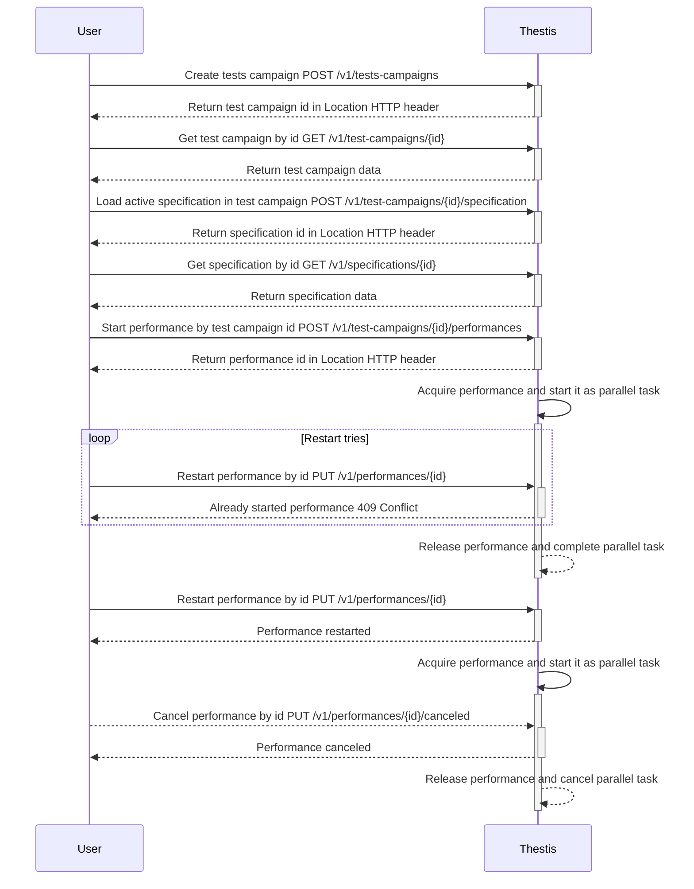
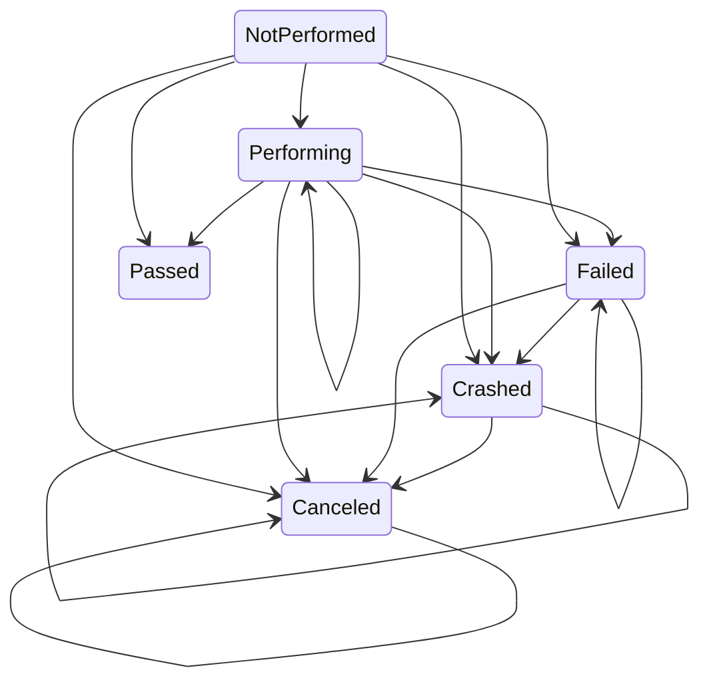

# thestis

[](https://codecov.io/gh/harpyd/thestis)

__Thestis__ is a service for auto tests with declarative description of tests

## Description

Imagine any CI/CD pipeline. For example you can pay attention to Github Actions. You must write workflow with declarative pipeline description and push it to remote. If you have specified `on.push` parameter, action with satisfying workflow will be started if you push. Or you can manually start Action pipeline. Pipeline may include linter, notifications, unit tests, integration tests, building, deploying, etc...

__Thestis__ is integration tests pipeline for e2e tests. So far pipeline may include 2 thesis types, HTTP and assertion.

Usually, quite a lot of code is written for integration tests in one of the appropriate programming languages, it can be Java, Python, Go, etc. I've been on several development teams. Each team used something of its own, someone pure Python, someone wrote their own project-oriented framework for testing on Python, someone wrote tests using Java, each project had its own integration tests, in the language of the project.

These tests could contain some errors, for example, in a self-written framework that I saw at work, the mapping of JSON fields into the structure was incorrectly written.

Other tests did not use competitive execution, which is why they were slower than they could.

In others, the code seemed to be correct, but it did not contain the business sense that the manager or analyst wanted, and, unfortunately, they do not understand the code.

In others, the code is constantly flapping, no one knows why, and does not want to engage, because the code is scary.

In general, there were enough problems. That's how the idea of a pipeline for e2e tests appeared. To get started, you need to create a `TestCampaign`.

In fact, a `TestCampaign` is the name of your test, information about it, and the history of all uploaded `Specifications` and completed submissions.

`Specification` is a declarative description of the test in BDD style, each test consists of `stories`, each `story` of `scenarios`, each `scenario` of `theses`. The `thesis` contains a description of the work of part of the test.

```
"Returns go to stock" — example of story

"Refunded items should be returned to stock" — example of scenario
```

The thesis can be either `given`, or `when`, or `then`:

```
"Given that a customer previously bought a blue garment from me and I have two blue garments in stock and three black garments in stock" — example of given thesis

"When they return the blue garment for a replacement in black" — example of when thesis

"Then I should have three blue garments in stock and two black garments in stock" — example of then thesis
```

You can see an example of the `Specification` at the link [here](https://github.com/harpyd/thestis/tree/main/examples/specification).

When you trigger the pipeline launch in some way, a `Performance` is created. We can say that the `Performance` looks like a program compiled from a `Specification`. The `Performance` is a kind of collected context about the test at the time of launch from the active `Specification` of the `TestCampaign`. Somewhat similar to Github Action. The `Performance` collects the entire dynamic context and the state of the current startup in the `Flow`.

A `Flow` is an analog of an attempt at Github Action. Stores information about the launch of the `Performance`. The `Performance` will always have one `Flow`. The `Performance` can be restarted (for example, if a test fails), each time the `Performance` is restarted, the number of `Flows` will increase.

During the test run, the `Flow` and each individual `thesis` execution status may end up in one of the states:
* __`NotPerformed`__
* __`Performing`__
* __`Passed`__
* __`Failed`__
* __`Crashed`__
* __`Canceled`__

If the test is __`NotPerformed`__, the test has not started yet for some reason. If the test is in __`Performing`__, then you should expect it to end. If you are in __`Passed`__, you can relax, because the test is passed! If the test is in __`Failed`__ state, it is worth looking at either the test or the system under the tests. If something went wrong in __`Crashed`__, perhaps from the network, or maybe from our side. If it is __`Canceled`__, then the test was canceled, it is possible that you canceled it, and it is possible that we did too because of too long execution.

It is worth noting that the tests achieve the most effective parallelization of the independent parts of the test. How? See below.

## Sequence diagram



## Flow

`Flow` — is unit of `Performance` work. Every working `Performance` parallel task accumulates `Performance` progress information and context in this entity. Each run of `Performance` corresponds to one `Flow`.

`Flow` consists of theses transitions (each with `Thesis` state and occurred errors) and common state. Every transition has state that represents `Thesis` performance progress. But common state is general status of `Performance`. `Flow` common state graph are shown in the diagram:



## Project structure

* `api` — API contract files like _OpenAPI_ files or _proto_ files
    * `openapi` — _OpenAPI_ contract files
* `build` - packaging and CI
    * `package` — cloud, container, OS package configuration and scripts
        * `dev/Dockerfile` — _Dockerfile_ for `Dev` environment
* `cmd` — main applications
    * `thestis/main.go` — application for **Thestis** backend server
    * `thestis-validate/main.go` — main application for **Thestis** validation util
* `configs` — **Thestis** server configuration files
* `deployments` — container orchestration deployment configurations and template
* `examples` — specification, code and other stuff example snippets
* `internal` — private **Thestis** application code
    * `adapter` — application level interface adapters
        * `auth` — implementations of authentication methods
            * `fake` — fake authentication with hardcoded mock secret (only for development)
            * `firebase` — authentication with _Firebase_
        * `logger` — implementations of logging interface
            * `zap` — logger adapter using _Uber's zap_
        * `metrics` — implementations of metrics interface
            * `prometheus` — metrics service collecting metrics with _Prometheus_
        * `parser` — implementations of specification parsers
            * `yaml` — service for parsing specification from _yaml_ files
        * `persistence` — implementation of persistence interfaces
            * `mongodb` — repositories and read models using MongoDB as persistence provider
        * `pubsub` — implementation of pub/sum mechanism
            * `nats` — signal event bus publisher and subscriber using NATS.io
    * `app` — application level interfaces and orchestration code
        * `command` — write operation use cases
        * `mock` — application level interfaces mocks
        * `query` — read operation use cases
    * `config` — **Thestis** application config parser
    * `domain` — domain logic of **Thestis** bounded by context
        * `performance` — pipeline that can run tests flow from specification using multithreading
        * `specification` — tests description in declarative BDD style
        * `testcampaign` — data about testing project, loaded specifications history and active specification
        * `user` — access rights differentiation
    * `format` — **Thestis** application format utils
    * `port` — application control logic
        * `http` — implementation of HTTP level
            * `auth` — authentication
            * `httperr` — mapping errors to HTTP codes
            * `logging` — HTTP level logging
            * `metrics` — metrics collecting
            * `v1` — implementation of `api/openapi/thestis-v1.yml` _OpenAPI_ specification
    * `runner` — **Thestis** backend application code for running from `cmd/thestis/main.go`
    * `server` — **Thestis** server for running from application config
    * `validate` — **Thestis** validate util code for running from `cmd/thestis-validate/main.go`
* `pkg` — public **Thestis** library code
* `swagger` — _Swagger UI_ static source files for UI rendering